## Statescript

### 1. Why Statescript?

- Non-programmers need to create high-level logic
- Define game state (don't just react to it) 
    + in a formalized explicit approach 
    + give full control of states/state transitions to the scripter
- Encourage modular code - better building blocks
- Painless reliable way to synchronize state machines
- Works with the rest of our engine
    + considered 3rd-party scripting solutiosn but ultimately decide to implement the language tightly integrated with our gameplay and engine layers

### 2. What is Statescript?

- **Visual scripting language**
- each script is a graph of nodes describing a chunk of gameplay
- examples: specific skill/ability/buf, common UI elements

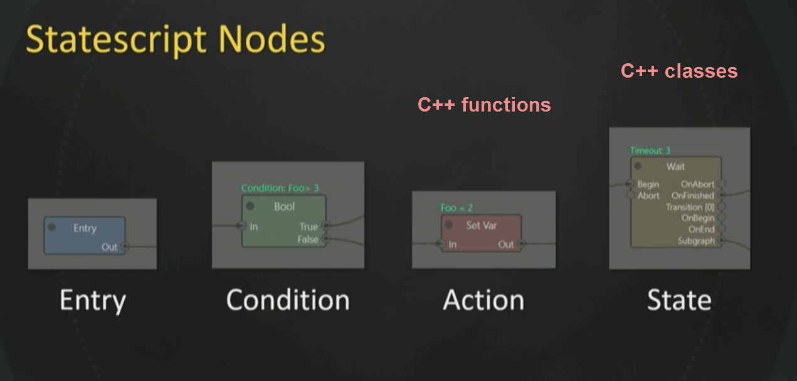

- Statescript provides bags of variables
+ values of script instance or its owner
+ primitive or array
+ can be "state-defined"

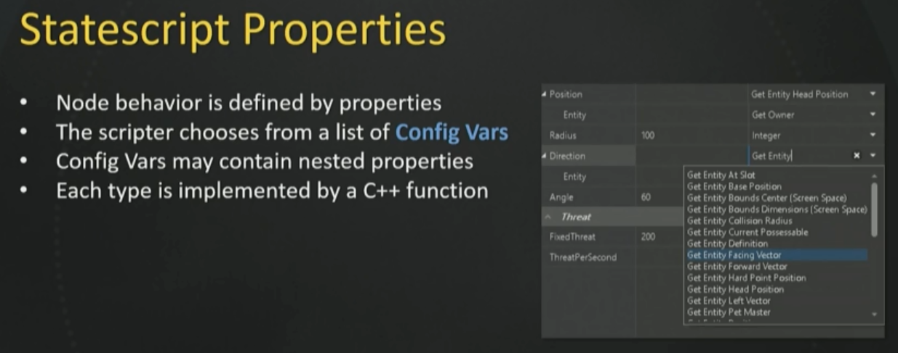

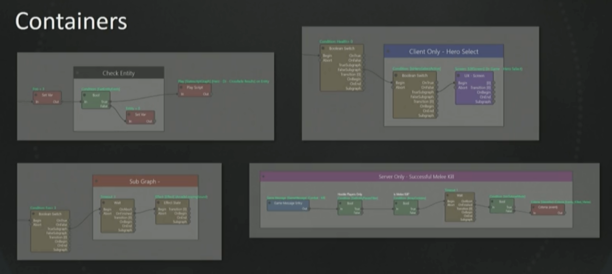

- Logic style
+ Imperative (do this, then check this, then do this)
+ Declarative (whenever this is the case, this should be the case)
+ Imperative style are leaves of declarative trees 

*video at 09:50* : ( a sample to show that **how to create a Statescript visually to implement a feature** )

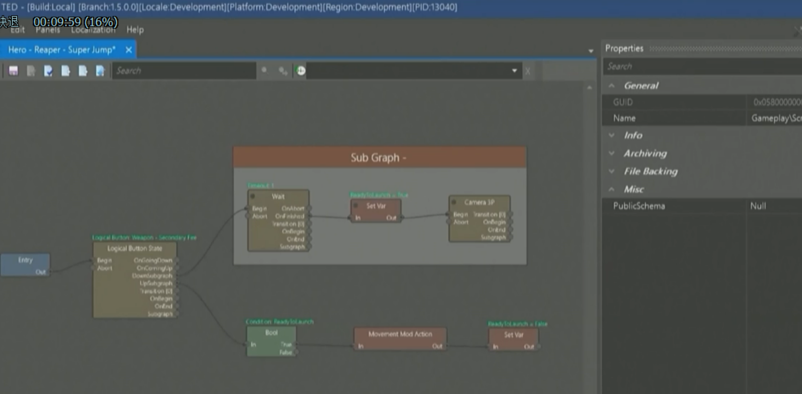

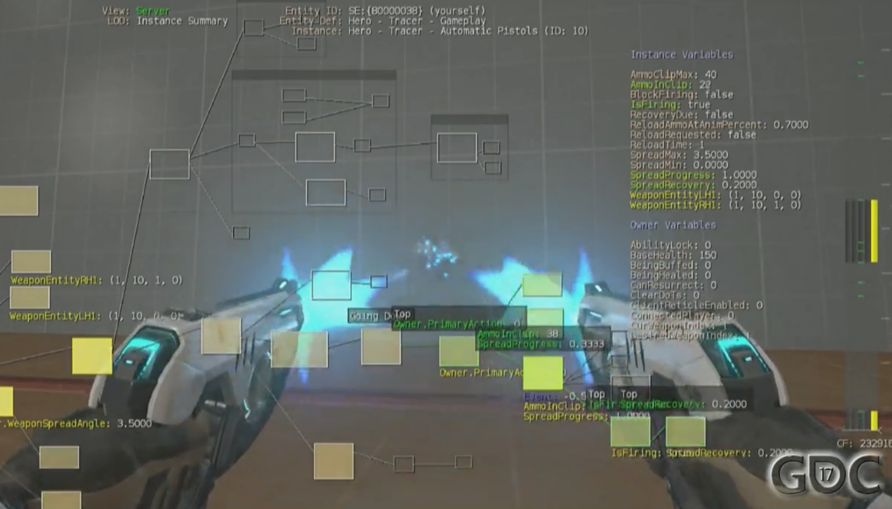

### 3. How is Statescript implemented?

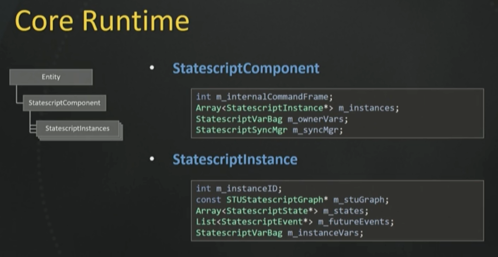

Structured Data - Assets defined by Structured Data (stu)

- Compile .stu files to generate code
- Supports attributes and runtime reflection

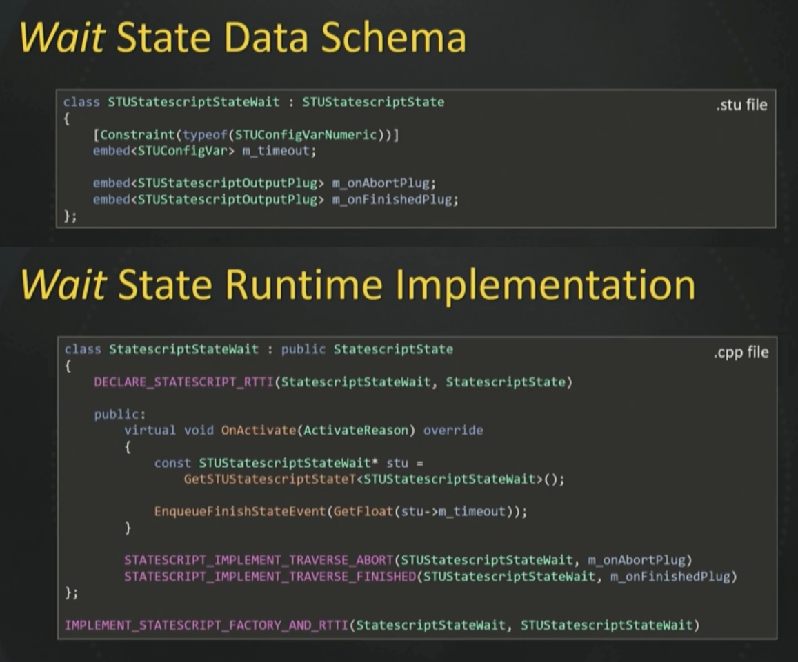

## Network requirements

- Usability - non invasive to the scripter (abstracting away network details)
- Responsiveness / Security / Efficiency / Seamlessness (minimizing noticeable networking side effects)

### Server Synchronization

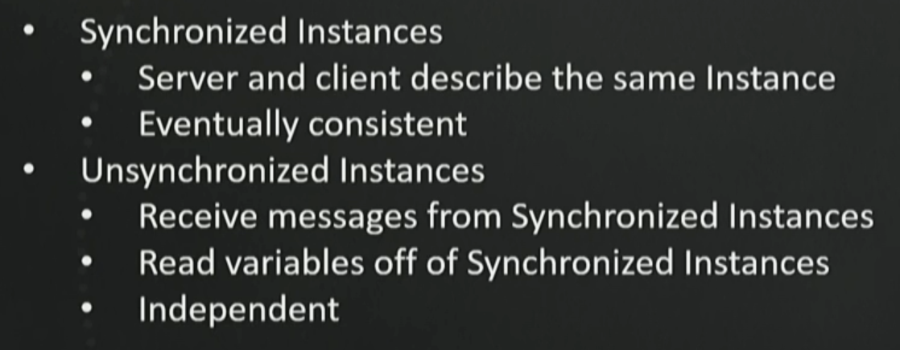

A StatescriptDelta is stored **until all clients have acknowledged receipt of its Command Frame**

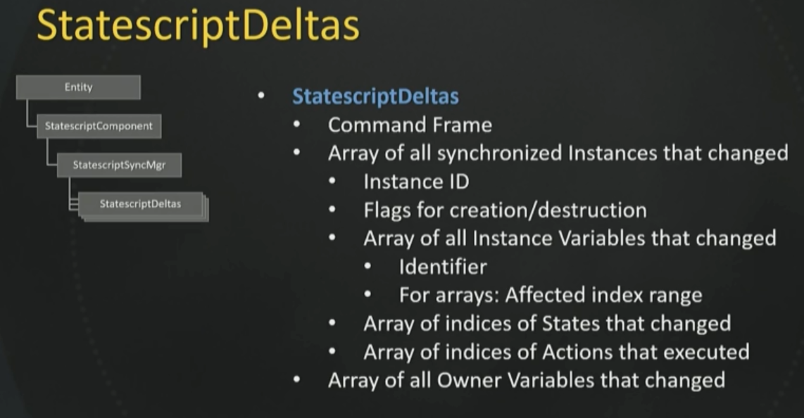

StatescriptGhosts keep track of what a particular client knows about a particular entity on server.

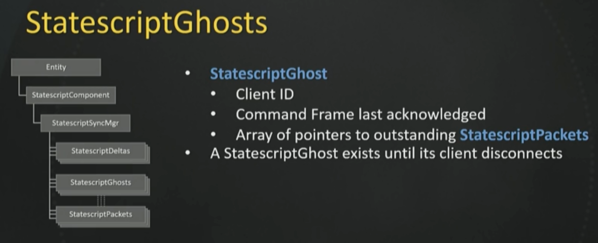

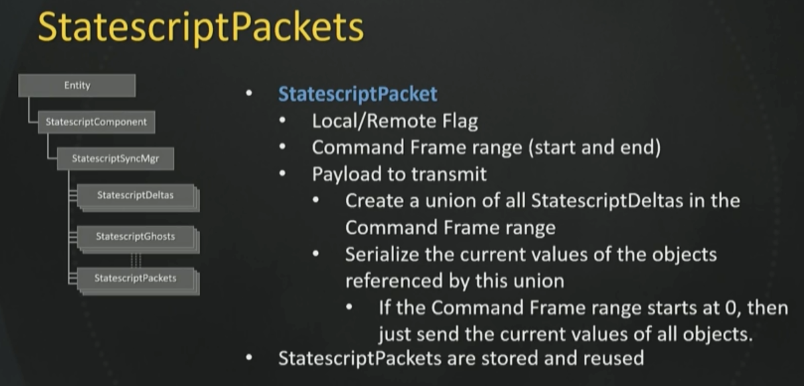

A StatescriptPacket is stored **until all clients have acknowledged receipt** of its end Command Frame.

#### A Live Demo

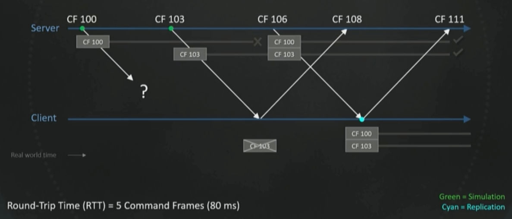

这里服务器一旦发现有同步包没被 ack (发了 103 之后) 就会把“**从未确认的包开始起的所有包**” (100-103) 都打到一起下发，而客户端在没收到 100 的情况下收到 103 虽然会 ack 但也不会处理逻辑，直到收到包含此前逻辑序列的完整包。

### Client Synchronization

客户端收到自己的包时，回滚超前时间段内的所有预测并重新 Simulate 到当前帧。

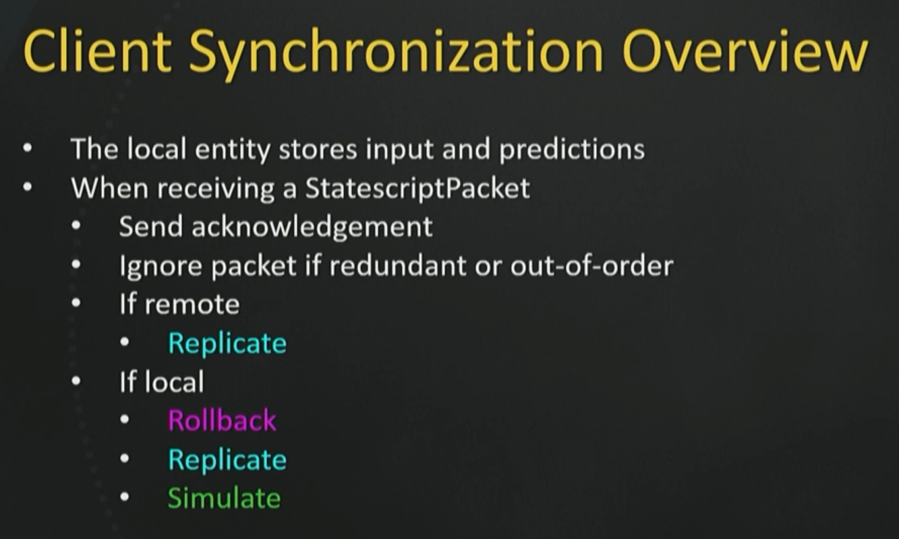
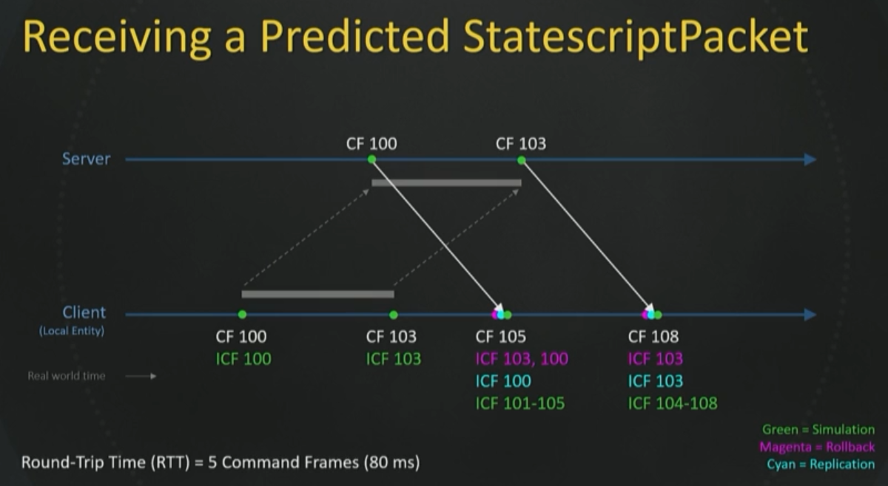
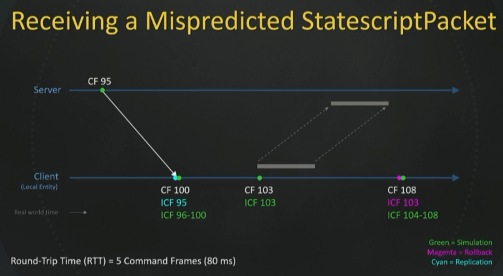

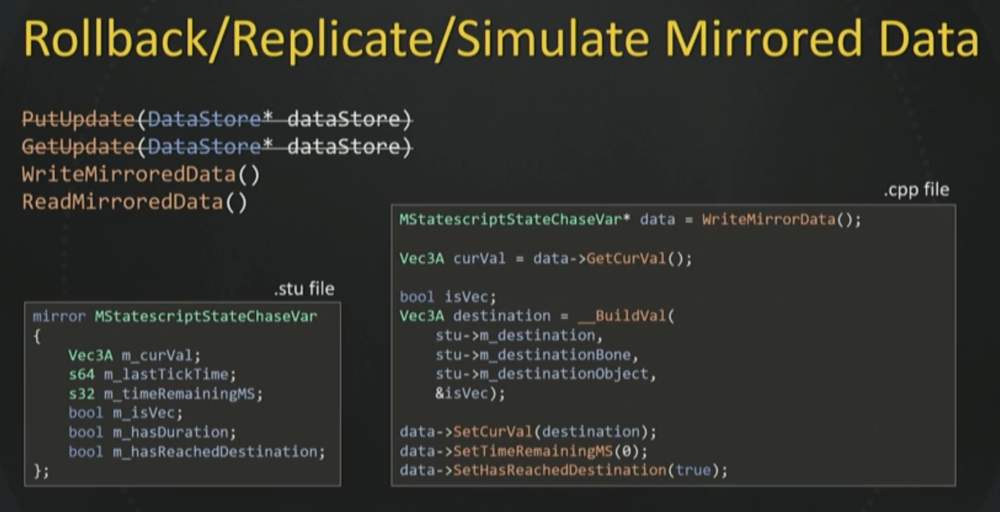
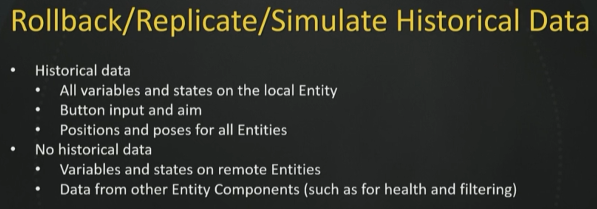

性能

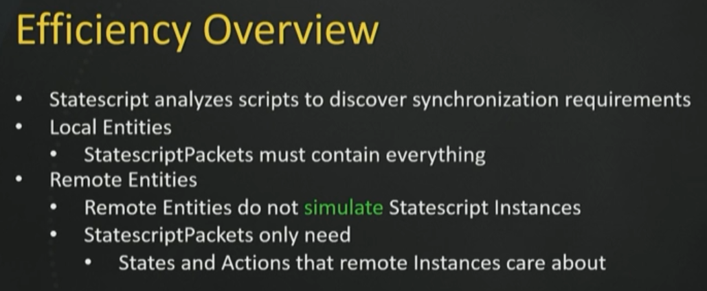

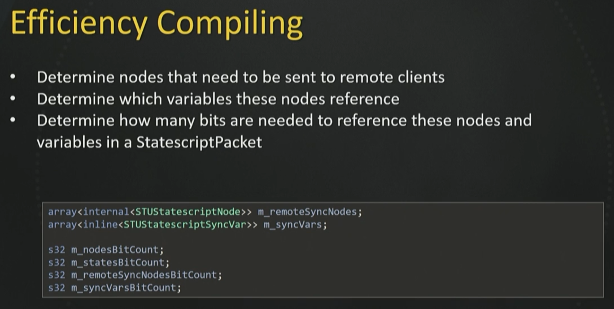

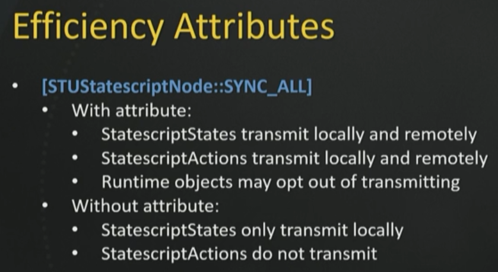

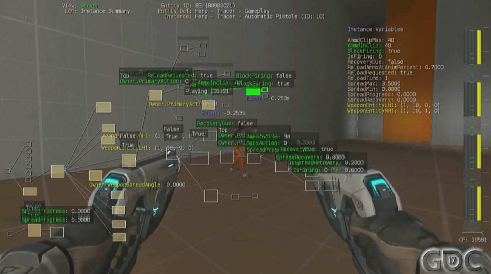

## Benefits & Costs

- Rapid Iteration
- Automatic Syncing and State Machines (New gameplay features can be added without writing sync or state machine logic in code)
- Fewer Lifetime and Desync Bugs

Up-Front Cost

- Hefty up-front implementation cost for the runtime, an editor and a debugger
- Learning Curve for engineers, particularly when deciding which parts of a feature belong in code versus script 
- Deciding scripting style in cases (imperative or declarative) 
- Occasional Workaround - The eventual-consistency networking model does not provide a perfect blow-by-blow replication 

## Q & A

- when to code, and when to script~ complex behavior like 'loops' would be done in code. when performance is considered.
- compiled binary assets collaboration~ exclusively check-out (make smaller scripts)
- how early do you decide to go with the Statescript solution~ some forms of prototypes of this system is developed in 2011 (before the game)
- debugger stores everything about the entity, written in C++, you can switch between server and client

